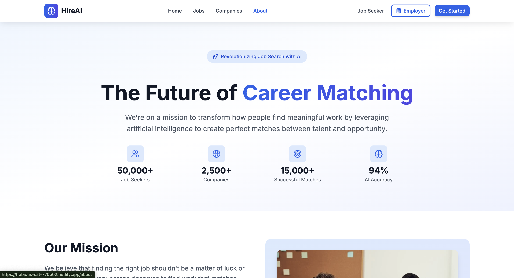
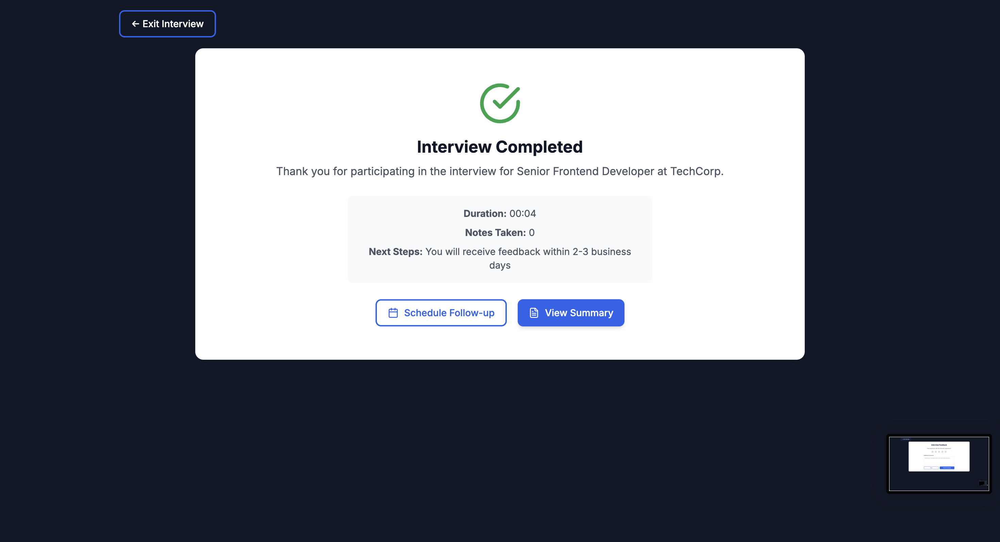

# 💼 HireAI – The Future of Intelligent Hiring

HireAI is a full-stack, AI-powered recruitment platform designed to streamline and enhance the hiring process for both employers and job seekers. From smart job matching to AI-assisted interviews and enterprise-level analytics, HireAI offers an end-to-end solution that rivals top hiring platforms.

🌐 **Live Demo**: [https://frabjous-cat-770b02.netlify.app/](https://frabjous-cat-770b02.netlify.app/)

---

## 🚀 Features

### 🧠 AI-Powered Intelligence
- **AI Resume Parser** – Extracts skills, experience, and key data from resumes
- **Smart Job Matching** – GPT-based job recommendation engine
- **AI Job Description Generator** – Create professional JDs with tone & format customization
- **AI Interview Coach** – Practice interviews with real-time AI feedback
- **AI Resume Builder** – Intuitive resume builder with smart suggestions

### 👨‍💼 Employer Dashboard
- Post and manage job listings with rich text editors
- Track candidate pipelines and application statuses
- Schedule interviews and evaluate responses
- Team collaboration with permission-based access
- In-depth analytics on hiring performance

### 👨‍🎓 Job Seeker Dashboard
- Smart job recommendations based on resume analysis
- Interview schedule and document repository
- Application tracking with real-time updates
- AI career trajectory insights & skills gap analysis
- Resume builder and interview preparation tools

### 🛠️ Admin Dashboard
- User, job, and content moderation tools
- System health monitoring and real-time alerts
- Role and permission management
- Billing and subscription management
- Audit trails, logs, and platform-wide analytics

---

## ⚙️ Tech Stack

### Frontend
- React 18 + TypeScript
- Tailwind CSS + Framer Motion
- Zustand, React Hook Form, React Router

### Backend
- Node.js + Express
- MongoDB + Mongoose
- REST APIs + WebSockets

### AI/ML
- GPT-4 based integrations
- Resume Parsing using NLP
- AI Interview, Resume Builder, and JD Generator

### DevOps & Security
- JWT Authentication, RBAC
- CORS, Helmet, Rate Limiting
- Vercel / Render / Netlify Deployment

---

## 📸 Screenshots

## 🖥️ Screenshots

### 🔹 Home Overview

### 🔹Admin Dashboard

### 🔹 Job Seeker Dashboard

### 🔹 Candidate Profile Page

---

